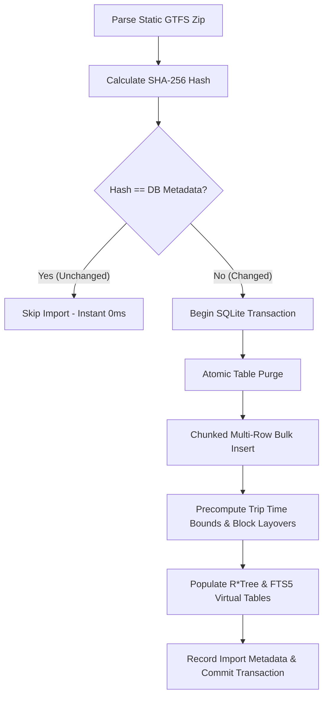

# Deep Dive: `gtfsdb` Module Dissection

The `gtfsdb` package (`maglev.onebusaway.org/gtfsdb`) is Maglev's **in-house transit database and storage engine**. It is not an off-the-shelf library, but an internal engine designed specifically for fast ingestion, querying, and spatial lookups of static GTFS schedules.

---

## 1. Is it In-House or a 3rd-Party Package?

| Layer | Type | Implementation / Dependency | Role |
| :--- | :--- | :--- | :--- |
| **Module Architecture** | **In-House** | `gtfsdb/` package | Core logic, batching algorithms, atomic re-imports, spatial queries, and connection tuning. |
| **SQL Engine & CodeGen** | **3rd-Party** | [`sqlc`](https://sqlc.dev/) (`v1.30.0`) | Compiles type-safe Go structs and functions from raw SQL (`schema.sql`, `query.sql`). |
| **Underlying Database** | **3rd-Party** | [SQLite 3](https://www.sqlite.org/) | Embedded relational storage; zero external database infrastructure required. |
| **SQLite Drivers** | **3rd-Party** | `mattn/go-sqlite3` (CGO) & `modernc.org/sqlite` (Pure Go) | Dual-driver architecture supporting native CGO and pure-Go fallback builds. |
| **GTFS Parser** | **3rd-Party** | `github.com/OneBusAway/go-gtfs` | Reads raw CSVs from the GTFS zip archive into Go structs before database insertion. |

---

## 2. Architecture & File Structure

```
gtfsdb/
├── schema.sql           # SQLite DDL: Tables, R*Tree, FTS5 virtual tables, and indexes
├── query.sql            # sqlc SQL queries for type-safe query generation
├── sqlc.yml             # sqlc compiler configuration
├── client.go            # Client lifecycle, DB initialization & metrics wrapper
├── config.go            # DB config & SafeBatchSize parameter calculations
├── db.go                # sqlc-generated DBTX interface and query dispatchers
├── query.sql.go         # sqlc-generated type-safe CRUD query methods
├── models.go            # sqlc-generated Go structs for database entities
├── helpers.go           # High-performance bulk loaders, hash checks, PRAGMA tuners
├── stops_rtree.go       # R*Tree spatial indexing for bounding-box stop queries
├── fts_queries.go       # Full-Text Search (FTS5) for stop names & codes
├── driver_cgo.go        # Build tags for CGO SQLite driver + FTS5 + math extensions
└── driver_pure.go       # Build tags for Pure-Go SQLite driver fallback
```

---

## 3. Data Ingestion Lifecycle (`StoreGtfsData`)



### Key Import Steps:
1. **Hash Verification**: Compares the incoming zip's SHA-256 hash against `metadata.file_hash`. If unchanged, the entire import is skipped.
2. **Atomic Swap**: Import happens entirely inside a single SQLite transaction (`BeginTx`). Existing rows are cleared and replaced atomically.
3. **Parameter-Safe Batching**: SQLite enforces a parameter limit of 32,766 (`SQLITE_MAX_VARIABLE_NUMBER`). `SafeBatchSize(fieldsPerRow)` dynamically calculates safe chunk sizes for multi-row `INSERT` statements.
4. **Precomputations**:
   - Computes minimum/maximum trip arrival times (`trip_time_bounds`).
   - Builds block sequences and layover intervals (`block_trip_indices`, `block_layovers`).
   - Syncs the 2D bounding boxes of stops into `stops_rtree`.

---

## 4. Performance & SQLite Tuning

Maglev tunes SQLite specifically for high-concurrency read operations:

* **WAL Mode (`journal_mode = WAL`)**: Allows non-blocking concurrent reads while background writes occur.
* **Synchronous Setting (`synchronous = NORMAL`)**: Reduces disk sync overhead while maintaining WAL durability.
* **Large Page Cache (`cache_size = -64000`)**: Allocates ~64 MB of RAM for in-memory page caching.
* **In-Memory Storage for Tests**: In test environments, uses `:memory:` databases for sub-millisecond setup and execution.
* **Connection Pooling**: Configures `MaxOpenConns`, `MaxIdleConns`, and `ConnMaxLifetime` based on runtime environment.

---

## 5. Key Interfaces & Usage Example

```go
// 1. Initialize client
cfg := gtfsdb.NewConfig("./gtfs.db", appconf.Production)
client, err := gtfsdb.NewClient(cfg)
if err != nil {
    log.Fatal(err)
}
defer client.Close()

// 2. Type-safe sqlc queries
agencies, err := client.Queries.GetAgencies(ctx)
stop, err := client.Queries.GetStop(ctx, "stop-1234")

// 3. Spatial bounding box lookup via R*Tree
stops, err := client.GetStopsInBoundingBox(ctx, minLat, maxLat, minLon, maxLon)
```
