# Deep Dive: REST API Architecture & HTTP Request Lifecycle

This document explains how HTTP requests are routed and processed across Maglev's REST API layer (`internal/restapi`), how `.json` and `{id}` routes are handled by unified handlers, and how middleware and data layers coordinate from request to response.

---

## 1. Route Handling: Are `.json` Endpoints Separate?

**No.** Every endpoint has **one unified handler**. There are no duplicate handlers for `.json` vs. standard REST paths.

* **Fixed/Query Endpoints**: Registered explicitly with `.json` in [`routes.go`](file:///Users/soumajit/Developer/oss/worktrees/maglev/playground/learning/maglev/internal/restapi/routes.go) (e.g., `/api/where/stops-for-location.json`, `/api/where/current-time.json`).
* **Resource/ID Endpoints**: Registered using path variables like `/api/where/stop/{id}`.
* **Transparent Suffix Stripping**: In [`internal/utils/http.go`](file:///Users/soumajit/Developer/oss/worktrees/maglev/playground/learning/maglev/internal/utils/http.go), `ExtractIDFromParams` strips `.json` automatically so both styles execute the same code:
  - `GET /api/where/stop/1_75403.json` $\to$ ID extracted: `"1_75403"`
  - `GET /api/where/stop/1_75403` $\to$ ID extracted: `"1_75403"`

---

## 2. Complete Request Lifecycle Diagram

```mermaid
flowchart TD
    Client["Client Request (cURL / Mobile App / Web)"]
    
    subgraph Global_Middleware["1. Global Server Middleware (Outer to Inner)"]
        Recovery["RecoveryMiddleware (Panic catcher -> 500 JSON)"]
        SizeLimit["SizeLimitMiddleware (1 MB request cap)"]
        ReqID["RequestIDMiddleware (X-Request-ID header)"]
        ReqLog["RequestLoggingMiddleware (Structured slog)"]
        Metrics["MetricsHandler (Prometheus latency histograms)"]
        Security["WithSecurityHeaders (CSP, HSTS, X-Frame)"]
        Freshness["FreshnessMiddleware (Feed freshness headers)"]
        Compress["CompressionMiddleware (Gzip compression >1KB)"]
        Version["VersionValidationMiddleware (/api/ validation)"]
        Expiry["GtfsExpiryMiddleware (Rejects expired feeds)"]
    end

    subgraph Route_Middleware["2. Route-Level Middleware"]
        Mux["http.ServeMux Route Matching"]
        CacheCtrl["CacheControlMiddleware (max-age headers)"]
        Auth["API Key Validation (?key= query param)"]
        RateLimit["Rate Limiter (Per-key token bucket)"]
        ETag["ETagMiddleware (304 Not Modified for static data)"]
    end

    subgraph Handler_Execution["3. Endpoint Handler Execution"]
        Extract["Extract & Validate Params (id, lat, lon, time)"]
        QueryStatic["Query Static Schedule (gtfsdb / SQLite)"]
        QueryRT["Query Realtime Delays/Positions (internal/gtfs in-memory)"]
        Merge["Overlay Realtime Updates onto Static Timetable"]
    end

    subgraph Response_Exit["4. Response Construction & Exit"]
        Envelope["Wrap in OneBusAway Response Envelope (Entry / List)"]
        JSONEncode["JSON Marshal & Stream Response"]
    end

    Client --> Recovery --> SizeLimit --> ReqID --> ReqLog --> Metrics --> Security --> Freshness --> Compress --> Version --> Expiry
    Expiry --> Mux --> CacheCtrl --> Auth --> RateLimit --> ETag
    ETag --> Extract --> QueryStatic --> QueryRT --> Merge --> Envelope --> JSONEncode
    JSONEncode -.->|Gzip Compressed Payload| Client
```

---

## 3. Middleware Pipeline Stages

### Stage 1: Global Server Middleware ([`cmd/api/app.go:L176-L201`](file:///Users/soumajit/Developer/oss/worktrees/maglev/playground/learning/maglev/cmd/api/app.go#L176-L201))
Constructed during server startup to protect and monitor every route:
1. **Panic Recovery**: Catches unhandled panics and outputs standard JSON errors.
2. **Request Size Limiting**: Rejects payloads exceeding $1\text{ MB}$.
3. **Request Tracing & Logging**: Injects request IDs and emits structured audit logs.
4. **Prometheus Metrics**: Records latency and HTTP response status counters.
5. **Security Headers**: Injects standard HTTP security headers.
6. **Gzip Compression**: Compresses responses over $1\text{ KB}$ via `klauspost/compress`.
7. **Feed Expiry Verification**: Validates that the loaded GTFS schedule has not expired.

### Stage 2: Route-Specific Middleware ([`internal/restapi/routes.go`](file:///Users/soumajit/Developer/oss/worktrees/maglev/playground/learning/maglev/internal/restapi/routes.go))
Applied per endpoint:
1. **Cache-Control**: Sets HTTP cache lifetimes (`CacheDurationShort` for live feeds, `CacheDurationLong` for schedules).
2. **API Key Authentication**: Validates query param `?key=` against allowed keys.
3. **Rate Limiting**: Applies token bucket rate limits per API key.
4. **Static ETag Caching**: Returns `304 Not Modified` if data is unchanged.

---

## 4. Handler Execution & Data Merge Flow

When a request reaches a handler (e.g. [`arrivals_and_departures_for_stop_handler.go`](file:///Users/soumajit/Developer/oss/worktrees/maglev/playground/learning/maglev/internal/restapi/arrivals_and_departures_for_stop_handler.go)):

1. **Parameter Sanitization**:
   - Extracts agency and stop codes: `agencyID, stopCode, ok := api.extractAndValidateAgencyCodeID(w, r)`.
   - Parses time filters (`minutesBefore`, `minutesAfter`).
2. **Static Timetable Lookup**:
   - Queries scheduled stop times from SQLite via [`gtfsdb.Client.Queries`](file:///Users/soumajit/Developer/oss/worktrees/maglev/playground/learning/maglev/gtfsdb).
3. **Realtime Overlay**:
   - Reads matching live delay predictions from in-memory `realTimeTripLookup`.
   - Reads live bus coordinates from in-memory `realTimeVehicleLookupByTrip`.
   - Fetches active service disruptions from `alertIndex`.
4. **Response Serialization**:
   - Formats data into standard OneBusAway JSON models (`models.NewEntryResponse` or `models.NewListResponse`).
   - Writes `200 OK` with JSON payload, flowing back through compression to the client.
