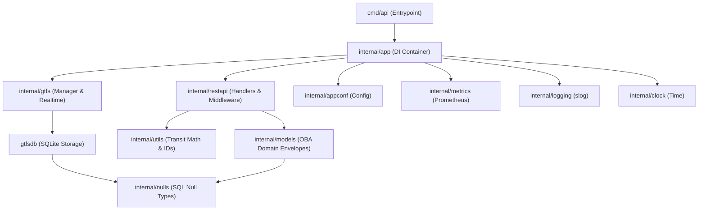

# Maglev Internal Modules Breakdown

This document provides a guided walkthrough of the packages located within the [`internal/`](file:///Users/soumajit/Developer/oss/worktrees/maglev/playground/learning/maglev/internal) directory, sorted from **most important to understand** (core business models, data management, and transit math) to **least important** (infrastructure, UI, and build metadata).

---

## 1. Quick Reference & Importance Tiers

| Tier | Package | Primary Role | Key Types / Files |
| :--- | :--- | :--- | :--- |
| **Tier 1: Core Domain** | [`internal/models`](file:///Users/soumajit/Developer/oss/worktrees/maglev/playground/learning/maglev/internal/models) | OneBusAway API contract & response envelopes | `EntryResponse`, `ListResponse`, `ArrivalAndDeparture`, `TripDetails` |
| **Tier 1: Core Domain** | [`internal/gtfs`](file:///Users/soumajit/Developer/oss/worktrees/maglev/playground/learning/maglev/internal/gtfs) | GTFS static ingestion & GTFS-RT pollers | `Manager`, `realtime.go`, `static.go` |
| **Tier 1: Core Domain** | [`internal/restapi`](file:///Users/soumajit/Developer/oss/worktrees/maglev/playground/learning/maglev/internal/restapi) | HTTP endpoints, middleware & routing | `RestAPI`, `routes.go`, handlers |
| **Tier 2: Foundation** | [`internal/app`](file:///Users/soumajit/Developer/oss/worktrees/maglev/playground/learning/maglev/internal/app) | Dependency Injection container | `Application` struct |
| **Tier 2: Foundation** | [`internal/utils`](file:///Users/soumajit/Developer/oss/worktrees/maglev/playground/learning/maglev/internal/utils) | Transit math, DST time, shapes, ID parsing | `CalculateServiceDate`, `ExtractAgencyIDAndCodeID` |
| **Tier 2: Foundation** | [`internal/appconf`](file:///Users/soumajit/Developer/oss/worktrees/maglev/playground/learning/maglev/internal/appconf) | JSON & CLI configuration validation | `JSONConfig`, `LoadFromFile` |
| **Tier 3: Utilities** | [`internal/nulls`](file:///Users/soumajit/Developer/oss/worktrees/maglev/playground/learning/maglev/internal/nulls) | SQLite nullable-to-Go safe converters | `String`, `NonEmptyString`, `Int64` |
| **Tier 3: Utilities** | [`internal/clock`](file:///Users/soumajit/Developer/oss/worktrees/maglev/playground/learning/maglev/internal/clock) | Deterministic time abstraction for tests | `Clock`, `RealClock`, `EnvironmentClock` |
| **Tier 4: Observability**| [`internal/metrics`](file:///Users/soumajit/Developer/oss/worktrees/maglev/playground/learning/maglev/internal/metrics) | Prometheus metric registry & collectors | `Metrics`, `StartDBStatsCollector` |
| **Tier 4: Observability**| [`internal/logging`](file:///Users/soumajit/Developer/oss/worktrees/maglev/playground/learning/maglev/internal/logging) | Structured `slog` helpers & safe defer cleanups | `SafeRollbackWithLogging`, `LogOperation` |
| **Tier 5: Peripheral** | [`internal/webui`](file:///Users/soumajit/Developer/oss/worktrees/maglev/playground/learning/maglev/internal/webui) | Landing page & diagnostics Web UI | `WebUI`, `SetWebUIRoutes` |
| **Tier 5: Peripheral** | [`internal/buildinfo`](file:///Users/soumajit/Developer/oss/worktrees/maglev/playground/learning/maglev/internal/buildinfo) | Compile-time git / version metadata | `CommitHash`, `Version`, `BuildTime` |

---

## 2. Module Dependency Graph

---

## 3. Deep Dive into Each Module

### 1. `internal/models/` — Domain Models & API Envelopes
* **Purpose**: Defines the JSON schema and data structures returned by the OneBusAway REST API.
* **Key Components**:
  * **Envelope Wrapper**: `EntryResponse` (single entity) and `ListResponse` (arrays) wrapping responses in standard OBA status codes, timestamps, and version metadata.
  * **References Map (`references`)**: Automatically attaches deduplicated metadata (agencies, routes, stops, situations) required by mobile clients.
  * **Domain Entities**: `ArrivalAndDeparture`, `TripDetails`, `VehicleEntry`, `Stop`, `Route`, `Shape`, `Situation` (service alerts).

### 2. `internal/app/` — Dependency Injection Container
* **Purpose**: Provides a single structured container (`Application`) that holds references to all core subsystems.
* **Key Components**:
  * Contains `GtfsManager`, `Config`, `Logger`, `Clock`, `Metrics`, and `DirectionCalculator`.
  * Every REST handler embeds `*app.Application`, allowing clean access to databases and services without relying on global variables.

### 3. `internal/utils/` — Transit Math, Geometry & ID Utilities
* **Purpose**: Houses domain algorithms, geometric operations, and string sanitizers.
* **Key Components**:
  * **Time Calculations**: `CalculateSecondsSinceServiceDate` handles DST-safe wall-clock seconds since midnight, supporting overnight/post-midnight trips.
  * **Geometry**: Google Polyline encoding/decoding and bounding box distance math.
  * **ID Parsing**: `ExtractAgencyIDAndCodeID` splits composite IDs like `"40_100"` into agency `"40"` and code `"100"`.

### 4. `internal/appconf/` — Configuration & Validation Engine
* **Purpose**: Parses, merges, and validates server configuration from JSON files, CLI flags, and environment variables.
* **Key Components**:
  * `JSONConfig` / `LoadFromFile`: Loads settings with fallback defaults.
  * **Security**: Enforces path sanitization to prevent directory traversal in file paths.
  * **Env Overrides**: Reads `GTFS_STATIC_AUTH_*`, `GTFS_REALTIME_AUTH_*`, and `GTFS_API_KEYS`.

### 5. `internal/nulls/` — Null Safety Bridge
* **Purpose**: Provides clean type-casting between database nullable types (`sql.NullString`, `sql.NullInt64`, `sql.NullFloat64`) and Go primitives/pointers.
* **Key Components**:
  * Prevents nil-pointer exceptions and ensures proper JSON serialization (`null` vs `""`).

### 6. `internal/clock/` — Deterministic Time Abstraction
* **Purpose**: Decouples time calculations from system wall-clock time for deterministic testing.
* **Key Components**:
  * `RealClock`: Returns `time.Now()` for production.
  * `EnvironmentClock`: Reads `FAKETIME` environment variables to simulate historical or future transit dates during tests.

### 7. `internal/metrics/` — Observability & Monitoring
* **Purpose**: Exposes Prometheus metrics at `GET /metrics`.
* **Key Components**:
  * Tracks HTTP request durations and status codes.
  * Measures SQLite connection pool statistics (active/idle/wait counts).
  * Measures background GTFS-RT feed polling latency and failure counters.

### 8. `internal/logging/` — Structured Logging & Resource Safety
* **Purpose**: Standardizes structured logging using Go's `log/slog`.
* **Key Components**:
  * Contextual logger propagation with trace IDs.
  * Safe cleanup utilities: `SafeRollbackWithLogging`, `SafeCloseWithLogging`.

### 9. `internal/webui/` — Web Landing Page & Diagnostics
* **Purpose**: Serves static HTML/JS assets for the landing page (`index.html`) and human-readable diagnostic pages.

### 10. `internal/buildinfo/` — Build Metadata
* **Purpose**: Captures build-time metadata (Git commit, branch, build timestamp, version) injected via `-ldflags` during compilation.
