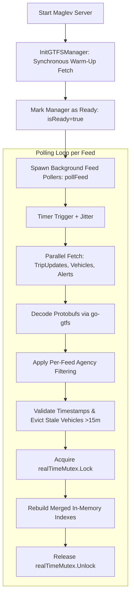

# Deep Dive: Realtime GTFS (`internal/gtfs`) Module Dissection

The `internal/gtfs` package (`maglev.onebusaway.org/internal/gtfs`) manages the complete lifecycle of **GTFS Realtime (GTFS-RT)** feeds in Maglev. It ingests Protobuf feeds in the background, sanitizes and merges multi-feed updates, maintains low-latency in-memory indexes, and overlays real-time trip status onto static schedules.

---

## 1. Is it In-House or a 3rd-Party Package?

| Layer | Type | Implementation / Dependency | Role |
| :--- | :--- | :--- | :--- |
| **Realtime Manager & Pollers** | **In-House** | `internal/gtfs/` (`Manager`, `realtime.go`) | Multi-feed polling loops, exponential backoff, jitter, staleness eviction, agency filtering, and lock coordination. |
| **Protobuf Deserializer** | **3rd-Party** | `github.com/OneBusAway/go-gtfs` (`proto`) | Decodes binary Protocol Buffers into Go struct representations of Trip Updates, Vehicle Positions, and Alerts. |
| **Concurrency & Synchronization** | **Go Standard Library** | `sync.RWMutex`, `sync.WaitGroup`, `sync/atomic` | Fast reader lock contention management and clean goroutine lifecycles. |
| **HTTP Transport** | **Go Standard Library** | Custom tuned `*http.Client` (`realtimeHTTPClient`) | Dedicated connection pool with bounded timeouts (10s), keepalives, and response payload limits (25MB). |

---

## 2. Architecture & File Structure

```
internal/gtfs/
├── gtfs_manager.go               # Application manager container, lifecycle, public query APIs, lock policies
├── realtime.go                   # Background feed pollers, parallel HTTP fetching, merging & in-memory indexing
├── config.go                     # Realtime & Static feed configuration structs
├── direction_precomputer.go      # Precomputes vehicle/stop travel directions from shapes
├── advanced_direction_calculator.go # On-demand shape trajectory calculations with LRU caching
├── shapes.go                     # Polyline decoders and shape caching
├── location_params.go            # Bounding box & coordinate distance validators
├── static.go                     # Static GTFS loader and periodic 24-hour updater
└── tidy.go                       # Optional gtfstidy data sanitizer
```

---

## 3. Realtime Ingestion & Processing Pipeline



---

## 4. Key Realtime Engine Components

### A. Dedicated Feed Pollers (`pollFeed`)
* **Dedicated Goroutines**: Each configured feed in `gtfs-rt-feeds` runs an isolated goroutine.
* **Failure Resilience**: Employs dynamic interval timers, exponential backoff on network errors, and **$\pm10\%$ randomized jitter** to eliminate thundering herd requests against upstream transit APIs.
* **Auto-Recovery**: If a feed fails consecutively for $>5$ minutes (`staleFeedThreshold`), its cached data is cleared to prevent serving stale transit predictions.

### B. Parallel Protobuf Ingestion (`updateFeedRealtime`)
* Uses `sync.WaitGroup` to fetch **Trip Updates**, **Vehicle Positions**, and **Service Alerts** concurrently.
* Bounded HTTP requests (10-second client timeout, 15-second context timeout, 25 MB payload safety limit).

### C. Agency Filtering (`filter*ByAgency`)
* When an agency ID filter is specified in configuration (`agency-ids: ["40"]`), entities matching other transit agencies are stripped out before index insertion.

### D. Vehicle Freshness & Eviction (`cleanupExpiredVehicles`)
* **Out-of-Order Rejection**: Drops incoming vehicle updates whose timestamps are older than existing data.
* **Retention Window**: Retains temporarily missing vehicles for up to **15 minutes** (`staleVehicleTimeout`) before purging them from memory.

---

## 5. In-Memory Indexing & $O(1)$ Lookups

To handle thousands of concurrent REST API queries with sub-millisecond latencies, Maglev maintains specialized in-memory lookup maps protected by `realTimeMutex` (`sync.RWMutex`):

| In-Memory Index | Key | Value | Purpose |
| :--- | :--- | :--- | :--- |
| `realTimeTripLookup` | `trip_id` (`string`) | Slice index (`int`) | Instant $O(1)$ lookup of real-time delays & schedule deviations for a trip. |
| `realTimeVehicleLookupByTrip` | `trip_id` (`string`) | Slice index (`int`) | Instant $O(1)$ lookup of live GPS coordinates and bearing for a trip. |
| `realTimeVehicleLookupByVehicle` | `vehicle_id` (`string`) | Slice index (`int`) | Lookup vehicle positions by physical vehicle / bus ID. |
| `duplicatedVehicleByRoute` | `route_id` (`string`) | `[]gtfs.Vehicle` | Tracks duplicate / unscheduled transit vehicles on a route. |
| `alertIndex` | `trip_id`, `route_id`, `agency_id`, `stop_id` | `[]gtfs.Alert` | Pre-indexed multi-dimensional service disruption alert lookup. |

---

## 6. Concurrency & Deadlock Prevention Policy

To eliminate deadlocks between static database queries and real-time state updates, `internal/gtfs` enforces a strict **Lock Ordering Hierarchy**:

$$\text{staticMutex} \longrightarrow \text{realTimeMutex}$$

```go
// RULE: If both locks are required, staticMutex MUST be acquired first.
// Never acquire staticMutex while holding realTimeMutex!
```

---

## 7. Query Integration Example

When an endpoint like `GET /api/where/trip-details/{id}.json` executes:

```go
// 1. Fetch static trip schedule from SQLite
trip, err := api.GtfsManager.GtfsDB.Queries.GetTrip(ctx, tripID)

// 2. Query in-memory realtime trip update (delays / cancellations)
tripUpdate, err := api.GtfsManager.GetTripUpdateByID(tripID)

// 3. Query in-memory realtime vehicle position (live GPS coordinates)
vehicle := api.GtfsManager.GetVehicleForTrip(ctx, tripID)

// 4. Query in-memory service alerts
alerts := api.GtfsManager.GetAlertsForTrip(ctx, tripID)
```
